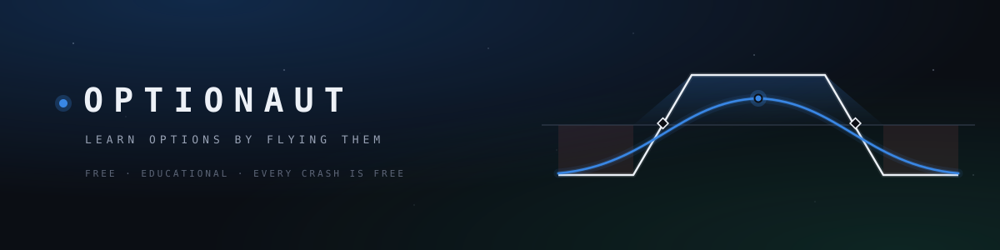
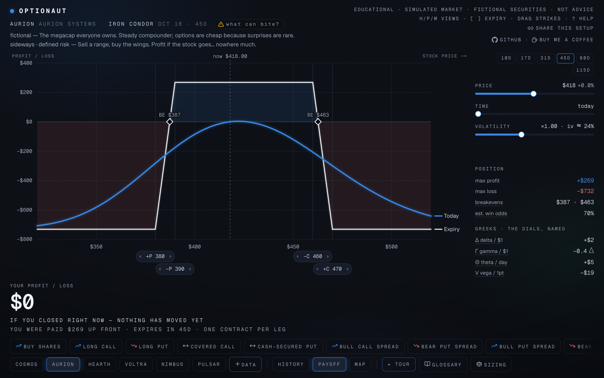
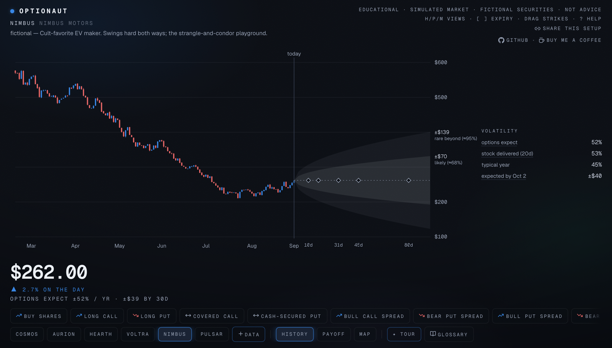
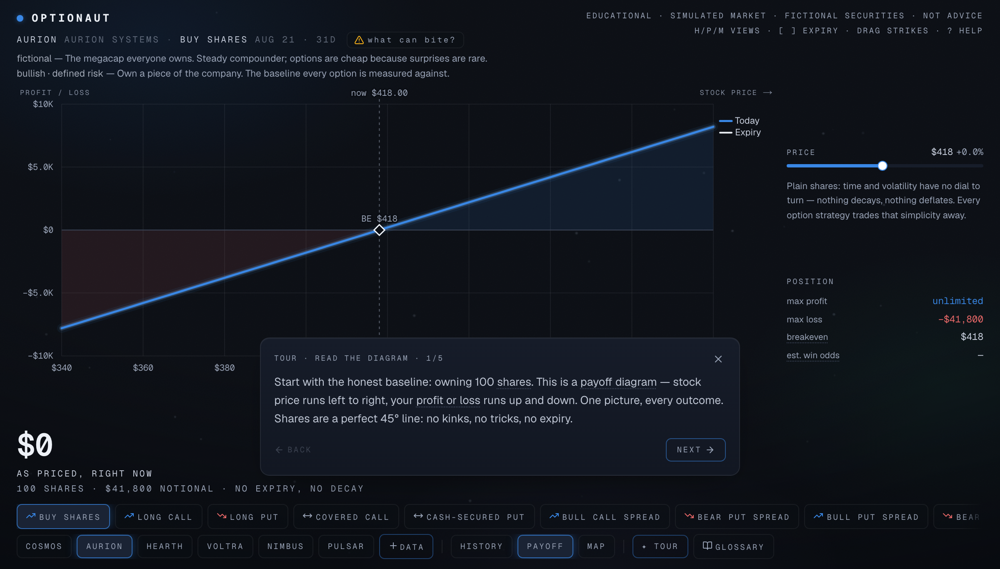

<p align="center">
  
</p>

<div align="center">

**A free, cinematic, full-screen instrument for understanding options trading.**
Fly every strategy from buying shares to iron condors — drag strikes,
fast-forward time, crush volatility — and watch the profit picture respond.
Every crash is free.

[](https://optionaut.org)
[](https://github.com/abhishekpradhan/optionaut/actions/workflows/ci.yml)
[](LICENSE)

[**Fly it →**](https://optionaut.org) · [Take a tour](https://optionaut.org/learn) · [Roadmap](#status--roadmap) · [Contributing](CONTRIBUTING.md)

</div>

> **Educational only.** Options involve a high degree of risk and are not suitable for
> all investors. Optionaut is not a brokerage and nothing in it is investment advice, a
> recommendation, or a solicitation. Several strategies are included specifically to
> demonstrate how money is lost.

## The instrument

One full-screen cockpit — no scrolling website. A chart fills the stage, the UI floats
at the edges as a HUD, and three views morph in place (`H` / `P` / `M`):

<p align="center">
  
  <em>PAYOFF — the neon expiry/today diagram. Drag the strike pills, twist the price /
  time / volatility dials (secretly delta, theta, vega), watch every number recompute.</em>
</p>

<p align="center">
  
  <em>HISTORY — a year of candles flowing into the options-implied expected-move cone:
  what the market thinks "likely" and "rare" look like, drawn to scale.</em>
</p>

<p align="center">
  
  <em>TOUR mode — six guided flights that drive the real instrument, with action gates
  ("drag the time dial yourself…"). Ten minutes from zero to iron condor.</em>
</p>

Plus the **MAP** view (a clickable price×time P/L heatmap — click any cell to jump the
cockpit to that scenario), a concept-gated glossary behind every dotted term, a
"what can bite?" honesty panel per strategy, and a full keyboard map (`?` in the app).
12 strategies × 6 simulated securities — plus any of your own, built from numbers you
type or a chain you download yourself (stored only in your browser).

Built for **desktop and landscape tablets** (pinch-to-zoom included); phones get an
honest boarding-pass page with an "enter anyway" hatch.

## Quickstart

No API keys, no environment variables, no accounts — the market ships with the repo.

```bash
npm install
npm run dev        # http://localhost:3000
npm test           # options-math + parser test suite (Vitest)
npm run lint
npm run build      # fully static output
```

## How the numbers are made

- **The market is simulated — deliberately.** The six hangar securities (COSMOS,
  AURION, HEARTH, VOLTRA, NIMBUS, PULSAR) are fictional: six-letter symbols no real
  listing can collide with, each an archetype with a personality (a sleepy index fund,
  a 95%-IV binary-event biotech…). Their histories, chains, smiles, and term
  structures are generated by the same engine that prices everything else
  ([`src/lib/sim/market.ts`](src/lib/sim/market.ts)), seeded and deterministic —
  regenerate anytime with `node --experimental-strip-types scripts/generate-market.mjs`.
  Why not real quotes? Exchanges license the *display* of market data (redistribution
  starts around $1,500/month), and every hobby-tier API's terms are personal-use-only.
  A simulated market has no licensing landmines, never goes stale, and can be shaped
  to teach: every volatility regime a lesson needs, on demand. The full research is
  logged as decision D11 in [`PLAN.md`](PLAN.md).
- **Real securities are bring-your-own.** The `+ data` chip builds a full chain from
  numbers you read off your broker's screen (symbol, spot, IV), or ingests the CSV
  that [Cboe's delayed-quotes page](https://www.cboe.com/delayed_quotes/) lets you
  download manually — your own lookup for personal use is exactly what their terms
  permit. Everything you add stays in your browser's localStorage: it never touches a
  server, which is what keeps Optionaut out of the data-redistribution business.
- **All interactive math is computed client-side** by a hand-written Black-Scholes-Merton
  engine ([`src/lib/options/`](src/lib/options)) — pricing, analytic greeks, and implied
  vol via Newton-Raphson with bisection fallback. It is validated in
  [`blackScholes.test.ts`](src/lib/options/blackScholes.test.ts) against textbook golden
  values (Hull), put-call parity to 1e-9, finite-difference agreement on every greek, and
  IV round-trips across a wide moneyness/tenor grid. Known, disclosed idealizations:
  European-style model for American-style options; entries assume mid fills;
  probability-of-profit assumes risk-neutral lognormal dynamics.
- **Profit is blue, loss is red — deliberately not green/red.** Roughly 1 in 12 men
  can't reliably distinguish the pair finance defaults to. The diverging palette is
  validated for common color-vision deficiencies, and meaning is never carried by color
  alone.

## Status & roadmap

Optionaut is **v1, live, and actively developed** — every commit to `main` deploys to
production.

- [x] The Cockpit — full-screen instrument, three morphing views, HUD, keyboard map
- [x] TOUR mode — six guided flights with action gates
- [x] Hand-written, test-anchored options-math engine
- [x] Simulated market — six fictional archetype securities, generated and deterministic
- [x] Bring your own security — quick-build from your numbers, or upload Cboe's CSV
      (stored only in your browser)
- [x] [optionaut.org](https://optionaut.org) + push-to-deploy
- [ ] Shareable strategy URLs — the full setup encoded in the link
- [ ] Scenario simulators — IV-crush earnings replay, position-sizing trials

The full decision log (D1–D11) with the *why* behind the shape of the product lives in
[`PLAN.md`](PLAN.md).

## Automation

- **[CI](.github/workflows/ci.yml)** — every push and pull request runs lint, the
  test suite, and a full production build. (It uses `npm install` rather than
  `npm ci` deliberately: macOS-authored lockfiles omit Linux-only wasm optional
  dependencies that a clean Linux `npm ci` rejects.)
- **[Advance the fictional calendar](.github/workflows/refresh-calendar.yml)** — once
  a month it bumps the simulated market's base date and regenerates the fixtures, so
  expiry dates never drift into the past. Fully deterministic, no external data; the
  test suite runs against the new calendar before anything is committed.

Deployment is Vercel's Git integration: every commit to `main` deploys to production
automatically; a failed build leaves the previous deployment live. (Pushes made by
the calendar workflow's `GITHUB_TOKEN` don't re-trigger CI — GitHub's loop
protection — but Vercel's own build still gates those deploys.)

## Stack

Next.js 16 (App Router) · React 19 · TypeScript · Tailwind CSS v4 · shadcn/ui ·
Zustand · d3-scale/shape/interpolate · custom SVG + canvas charts · Vitest.
Every known route is prerendered static; unknown ticker URLs (your own securities)
render on demand so deep links to them still resolve.

## Credits

- Visual language inspired by [Universe Atlas](https://universeatlas.org/).
- Built with [Next.js](https://nextjs.org), [shadcn/ui](https://ui.shadcn.com),
  [d3](https://d3js.org), and [Lucide](https://lucide.dev) icons.

## License

[MIT](LICENSE) © 2026 Abhishek Pradhan
